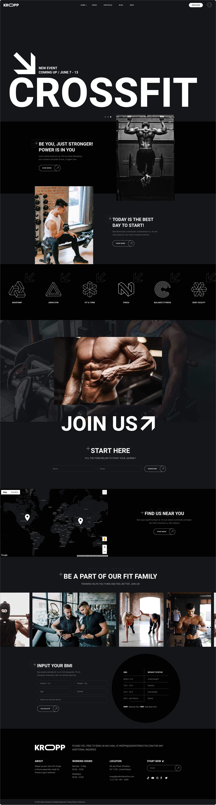

# Kropp Fitness

A static single-page fitness club website built with pure HTML and CSS, without JavaScript frameworks or build tools.

## Preview



## Features

- Responsive navigation with burger menu
- Event announcement banner
- Motivation section with cards
- Training types catalog (Maxpump, Aron Gym, Fit & Tone, Forza, Balance Fitness, Body Sculpt)
- Subscription form (Join Us)
- Branch locations map
- Fit Family gallery
- BMI calculator form (height, weight, age, gender, activity factor) with weight status table
- Footer with working hours, contacts, subscription form, and social media links (TikTok, YouTube, Instagram, Facebook, Twitter)

## Tech Stack

- **HTML5** — semantic markup
- **CSS3** — custom properties (CSS Variables), `@import` for modular style structure
- **Fonts** — Heebo (Light, Bold), Yantramanav (Bold) — self-hosted via `woff2`

## Architecture

The project is a single HTML page (`index.html`) with styles organized in a modular fashion via CSS `@import` in `styles/main.css`.

Styles are split into three layers:

- **base** — normalization, fonts, CSS variables, global styles, utilities
- **components** — reusable elements (buttons, inputs)
- **sections** — styles for each page section

## Getting Started

### Prerequisites

Any modern web browser. No build step or dependency installation required.

### Running Locally

Open `index.html` directly in a browser, or start a local server:

```bash
# Python
python -m http.server 8000

# Node.js (npx)
npx serve .
```

## Project Structure

```
kropp-fitness/
├── index.html                  # Main (and only) page
├── assets/
│   ├── fonts/                  # Local fonts (woff2)
│   ├── icons/                  # SVG icons (arrows, plus)
│   └── images/
│       ├── logo.png            # Logo
│       ├── map.jpg             # Map image
│       ├── family/             # Gallery photos
│       ├── join-us/            # Background and video poster
│       ├── motivation/         # Motivation section photos
│       └── training-types/     # Training type SVG icons
└── styles/
    ├── main.css                # Entry point (imports)
    ├── base/                   # Normalization, variables, fonts, utilities
    ├── components/             # Buttons, inputs
    └── sections/               # Section styles (header, banner, footer, etc.)
```

## Contributing

1. Fork the repository
2. Create a feature branch (`git checkout -b feature/my-feature`)
3. Commit your changes (`git commit -m 'Add my feature'`)
4. Push the branch (`git push origin feature/my-feature`)
5. Open a Pull Request

## License

No license specified in the repository.
